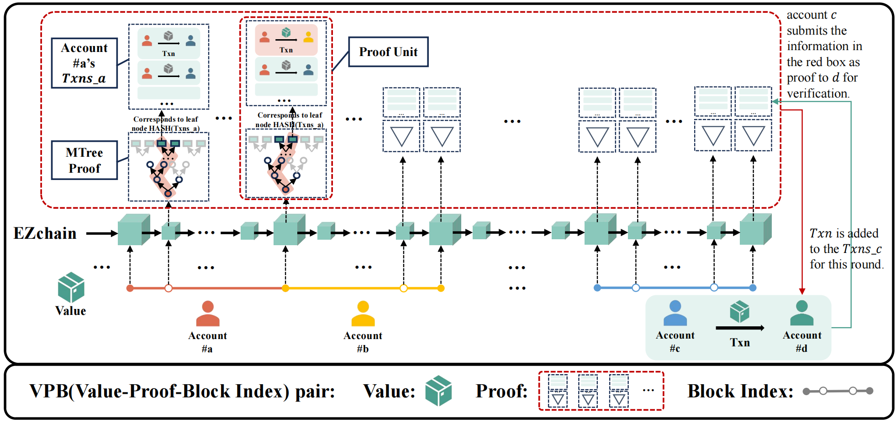

Date：2025/10/30
By：LdX

摘要：Proofs的数据结构及逻辑设计在实现中较为复杂，故编制此文档。其核心难点在于真实实现中需要考虑不同Value之间存在大量重复的Proof unit模块，故需要进行针对性优化处理。

原本的设计：由于V（value）、P（Proofs）、B（Block index list）在逻辑上是一一对应的关系，具体地，一个Value，对应一个Proofs，对应一个Block index list。
其中一个Proofs由多个不同的Proof unit组成，原则上的V-P-B数据结构设计的可视化如下图：
。

问题与挑战：正如摘要中所述，大量冗余重复的Proof unit内容导致存储空间的极大浪费，需设计一种优雅的优化结构进行合理管理。

解决方案：Proofs拟采用新增类指针或映射表数据结构来处理此问题，即，Proofs不再是简单的Proof unit列表，而是一个映射表，维护Proofs和Proof unit的映射关系。
对于不同的Value，其对应的Proofs包含同一个Proof unit时，可以用映射表映射到同一个存储空间上的Proof unit。
在V-P-B管理操作时（增删改查等），主要针对其映射关系进行操作，只有当某个Proof unit的全部映射关系被删除时，才会在存储上真正删除此Proof unit。

另：Proofs和Proof unit还需要实现永久存储（硬盘存储）功能，以及读取等功能。